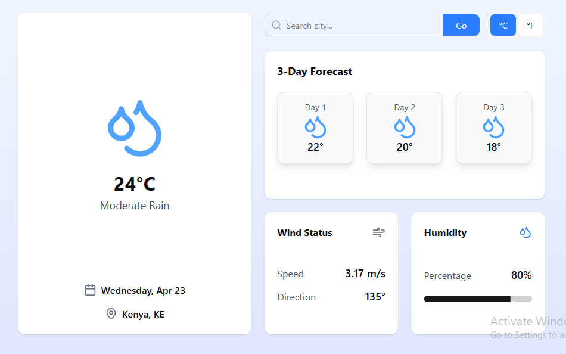
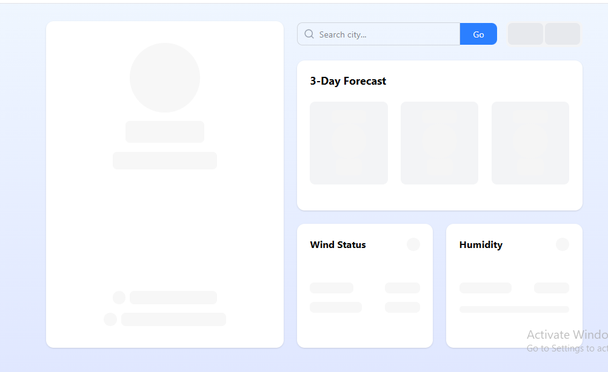

# Weather App Dashboard

A beautiful weather application built with Next.js (TypeScript) and Laravel API, featuring real-time weather data from OpenWeatherMap.



## Features

- Current weather conditions with visual icons
- 3-day weather forecast
- Temperature unit toggle (°C/°F)
- Wind status and humidity indicators
- Responsive design for all screen sizes
- Smooth animations with Framer Motion
- Skeleton loading states

## Screenshots

### Loading State



### With Data


## Live Demo

[View Live Demo](https://weather-app-pink-five-41.vercel.app/)

## Technologies Used

### Frontend

- Next.js 15
- TypeScript
- Tailwind CSS
- RippleUI
- Framer Motion (for animations)
- Lucide React (icons)

### Backend

- Laravel 10
- OpenWeatherMap API

## Getting Started

### Prerequisites

- Node.js (v18+)
- PHP (v8.1+)
- Composer
- OpenWeatherMap API key

### Installation

1. **Clone the repository**

   ```bash
   git clone https://github.com/kevykibbz/weather-project.git
   cd weather-project
   ```

2. **Frontend Setup**

   ```bash
   cd weather-app
   npm install
   npm run dev
   ```

3. **Backend Setup**

   ```bash
   cd weather-api
   composer install
   cp .env.example .env
   # Update environment variables in .env
   php artisan key:generate
   php artisan serve
   ```

## Project Structure

weather-app/
├── weather-app/              # Next.js application
│   ├── components/           # React components
│   ├── app/                  # Next.js pages
│   ├── services/             # API services
│   └── types/                # TypeScript types
└── backeweather-api/                # Laravel application
    ├── app/                # Application logic
    ├── routes/             # API routes
    └── services/           # Weather service

## Contributing

1. Fork the project  
2. Create your feature branch  

   ```bash
   git checkout -b feature/AmazingFeature
   ```

3. Commit your changes

   ```bash
   git commit -m 'Add some amazing feature'
   ```

4. Push to the branch

   ```bash
   git push origin feature/AmazingFeature
   ```

5. Open a Pull Request

## License

📜 This project is licensed under the **MIT License** - see the [LICENSE](LICENSE) file for details.

## ✉️ Contact

**Your Name**  

- GitHub: [@kevykibbz](https://github.com/kevykibbz)  
- Twitter: [@Kevin36285655](https://x.com/Kevin36285655)  
- Email: <kibebekevin@gmail.com>  
- LinkedIn: [Kevin Kibebe](https://www.linkedin.com/in/kevin-katenya-ge-114457168/)  

🔗 **Project Link**: [https://github.com/kevykibbz/weather project](<https://github.com/kevykibbz/weather> project)
